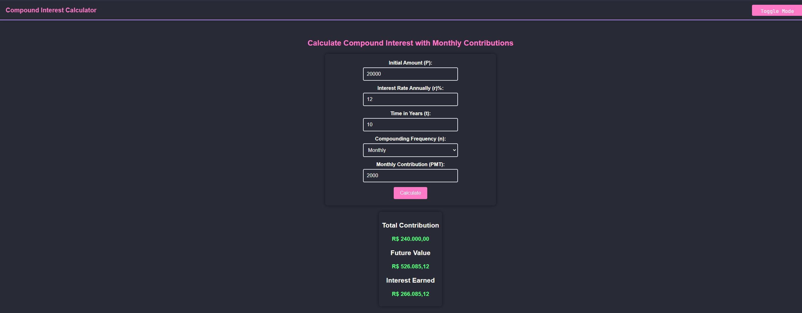
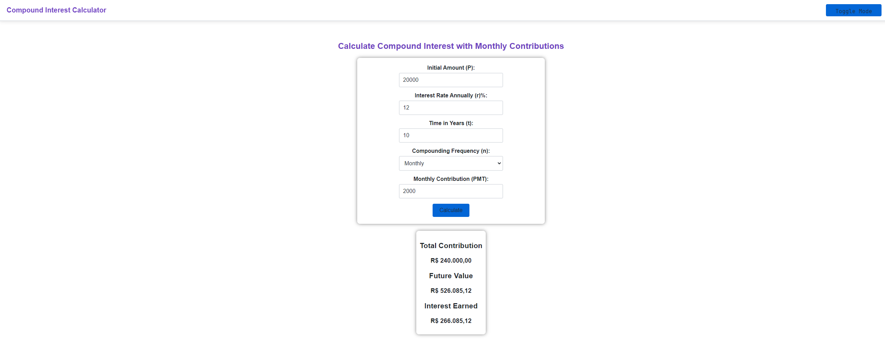

# Compound Interest Calculator

This project is a web-based **Compound Interest Calculator** that allows users to calculate future values based on their initial investment, regular monthly contributions, interest rate, and the time period of investment. It features a clean and modern design with support for both light (GitHub) and dark (Dracula) themes.

